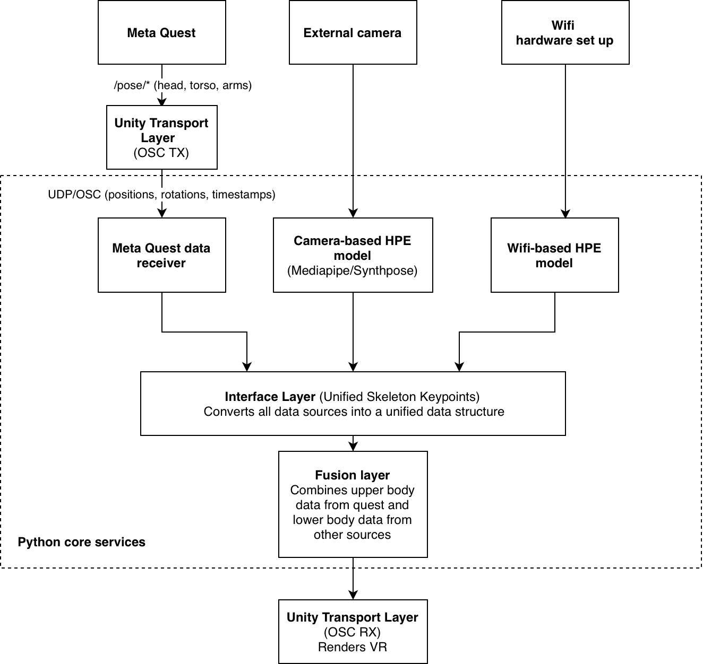

# pose-estimation-by-camera-and-vr-headset

## Getting started

This is a hybrid framework for human body pose estimation using **MediaPipe**/**SynthPose MMPose** with external cameras, synchronized with **Meta Quest** tracking data for VR applications.

## System Architecture



## Installation and run camera modules
 Python 3.10 is recommended

1. **Setup Mediapipe env:**

```
cd environments
.\setup-mediapipe.bat
.\run-mediapipe.bat
```

2. **Setup Synthpose env:**

```
cd environments
setup-synthpose.bat
run-synthpose.bat
```

## End-to-end OSC smoke test (Unity - Python)

The following steps demonstrate the OSC transport loop without a connected Quest. The Unity scene will use the simulated head pose built into ``OscPoseSender`` so that packets can be transferred.

1. **Start the Camera stream server (this includes the osc_pose_receiver).**

   ```bash
   python pose_stream_server/media/mediapipe_stream_server.py --osc-port 9000
   ```

2. **Open the Unity project.**

   * Launch Unity Hub and add the ``unity_client`` folder as a project.
   * Open the project with Unity.

3. **Configure ``OscPoseSender`` in the scene (only required once).**

   * Create an empty GameObject (e.g. ``OSC Pose Sender``).
   * Attach the ``OscPoseSender`` (or ``OscPoseSenderStub`` if the HMD is not connected) script located under ``Assets/Scripts``.
   * In the Inspector, set **Remote Host** to ``127.0.0.1`` and **Remote Port** to ``9000`` so the component targets the local Python listener.
   * Leave **Simulate Hmd When Unavailable** enabled so the script generates fake HMD poses when the Quest is disconnected.

4. **Enter Play Mode in Unity.**

   * Press the **Play** button in the Unity Editor.

5. **Observe OSC packets and Mediapipe data on the Python side.**

   The terminal running ``mediapipe_stream_server.py`` begins logging packets such as:

   * `Pose snapshot from camera @ …` lines every time landmarks are detected by the webcam.
   * `Unity OSC packet …` entries whenever OSC data arrives.
   * Once both streams are alive, `Fusion workspace ready` confirming the rendezvous point for future blending.